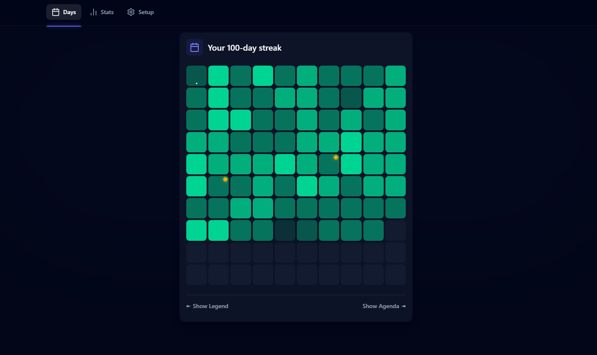
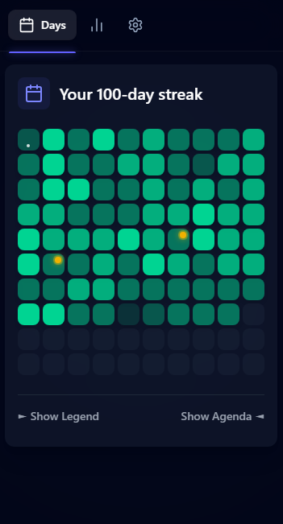

# 📅 Habit Tracker

> **🚀 Live Demo:** [Habit Tracker](https://habit-tracker-3-app.web.app/)  
> **💼 Featured Project:** Developed by Xabier Raso

A habit tracking application built with **React 19** and **Vite**. This project includes features like a visual progress grid and real-time database integration with Firebase.

> [!NOTE]
> **This repository is intended for code review purposes.**  
> Technical reviewers can inspect the source code to evaluate the implementation, code quality, and styling. For a live demonstration, please use the link above.

---

## 📢 **Important Access Note**

> **New user registration is currently restricted.**  
> Please use the **"Demo Mode"** on the login page to explore the application without needing an account.

---

## ✨ Key Features

- **Code Splitting**: Uses `React.lazy` and `Suspense` to load pages on demand, reducing the initial loading size.
- **Component Organization**: Components are grouped into `habits`, `calendar`, and `layout` for better project structure.
- **Visual Progress Grid**: A custom **10x10 (100 days)** dashboard with a heatmap that reflects completion density.
- **Demo Mode**: Allows switching between local state and **Firebase** for data storage.
- **Calendar Integration**: View-only integration with Google Calendar for scheduling context.
- **Modern UI**: Styled with **Tailwind CSS 4** and accessible components from **Headless UI**.

---

## 📸 Screenshots

|                      Dashboard View                       |                  Mobile Responsive                  |
| :-------------------------------------------------------: | :-------------------------------------------------: |
|  |  |
|              _Heatmap Grid & Habit Tracking_              |             _View on different devices_             |

---

## 🛠️ Tech Stack

- **Frontend**: **React 19**, TypeScript, **Vite**.
- **Styling**: **Tailwind CSS 4**, Heroicons.
- **Backend**: Firebase (Auth, Firestore, Hosting).
- **Navigation**: React Router 7.
- **State Management**: React Context API.

---

## 🧠 Technical Details

### Performance

The application uses **Code Splitting** to optimize the bundle size. Pages are only loaded when the user navigates to them, which prevents unnecessary data download on the initial visit.

### Structure

The project follows a directory structure organized by domain:

- **`habits/`**: Habit logic and tracking.
- **`calendar/`**: Visualization and integrations.
- **`layout/`**: Page structure and feedback.
- **`ui/`**: Basic UI elements (Buttons, Modals).

### Demo vs Auth Mode

The app implements a pattern to swap providers based on a "Demo" flag. This allows testing all functionalities without writing to the production database.

---

## ⚖️ Personal Project & Copyright

This is a personal project developed by **Xabier Raso** for portfolio and code review purposes. Feel free to explore the code for learning or technical evaluation.

However, please note that **commercial use, redistribution, or publishing this application as your own is not permitted** at this time.

© 2026 Xabier Raso.
